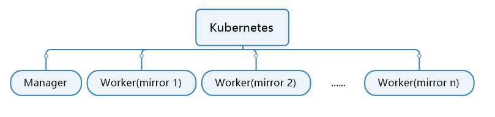

# 简介
   通过Kubernetes搭建使用tunasync同步的镜像源

   

   本项目是前作 [tunasync-manage-script](https://github.com/ztelliot/tunasync-manage-script) 的延申

## 如何使用 / HowTo
   ### 准备
   首先确保K8s可用，并部署了`metrics-server`
   
   由于脚本需要进入容器统计镜像大小，因此必须在主节点使用
   
   安装Python3、pip
   
   `yum install -y python3 python3-pip`

   或

   `apt install -y python3 python3-pip`
   
   克隆本项目
   
   `git clone https://github.com/ztelliot/tunasync-kubernetes.git && cd tunasync-kubernetes`

   安装依赖
   
   `pip3 install -r requirements.txt`

   ### 开始
   修改`config.json`

   `mv example.config.json config.json && vi config.json`

   > `port`: 希望开放manager api的端口（为确保安全，将以`cluster ip`形式开放
   >
   > `name`: 部署manager的名称（为了方便，worker名称将根据mirror的名称生成
   > 
   > `namespace`: 希望部署manager和worker的命名空间
   > 
   > `image`: 部署manager所使用的镜像（只要保证能访问到api即可
   > 
   > `sc`: 部署使用的储存类
   > 
   > `node`: 可选项，限定pod调度的节点（该项仅用于控制worker的节点
   > 
   > `mirrors`: 将用于储存mirror的基本信息
   
   随后可以通过 `python3 main.py` 启动脚本

   脚本将在首次启动时将`manager`部署到k8s，`tunasynctl` 可以通过`exec` `manager`调用

   等待片刻，待`manager`启动完成，就可以愉快的添加镜像任务了

   ###添加镜像
   再次启动脚本`python3 main.py`

   选择`新增镜像`

   参照指引填入信息

   > `mirror名称` 为同步镜像的名称，由于k8s限制，名称中能出现的特殊符号仅为`-`，这将用于标识worker，不能重复
   > 
   > `同步方式` `同步源` `线程数` `同步周期` `内存限制` `rsync选项` `同步额外选项` 等详见`tunasync`官方文档
   > 
   > `使用的容器镜像` 为部署使用的基础镜像，要求能启动，配置文件将放置在容器内`/app/worker.conf`
   > 
   > `镜像最大占用大小` 视情况设置

   出现 `Create Success` 代表已生成yaml并开始部署，yaml文件将储存在 `conf/{name}.yaml`   

   随后可以进入`镜像管理`界面，可以看到 Pod 状态为 `ContainerCreating` ，再次进入直到状态变为 `Running` 代表部署成功

   随后可以进行相关镜像的管理

   ### 自动更新镜像大小 & 出错自动重试
   可以将 `update.py` 添加进系统的`crontab`中，例如:

   每两小时进行一次
 
   `0 */2 * * * cd /root/tunasync-kubernetes && /usr/bin/python3 update.py`
   
   ### 关于Worker镜像的定制
   可以参照`worker/worker.dockerfile`进行相关设置
   
   例如，你需要使用`tuna/tunasync-scripts`内的相关脚本，你可以简单的将基础容器修改为`tunathu/tunasync-scripts`以达到配置环境的效果

   ### 关于tunasync
   预设的镜像仅支持x86_64，有额外需求请自行构建镜像
